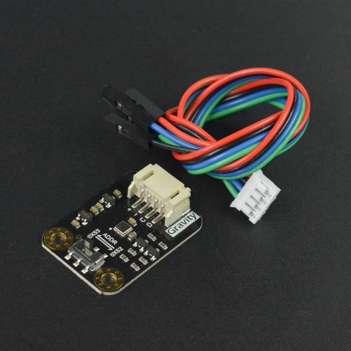

# DFRobot_ENS160
* [中文版](./README_CN.md)

The ENS160 is a digital multi-gas sensor solution, based on metal oxide (MOX) technology 
with four MOX sensor elements. Each sensor element has independent hotplate control to 
detect a wide range of gases e.g. volatile organic compounds (VOCs) including ethanol, 
toluene, as well as hydrogen and nitrogen dioxide with superior selectivity and accuracy.
For indoor air quality applications, the ENS160 supports intelligent algorithms to digitally 
process raw sensor measurements on-chip. These algorithms calculate CO2-equivalents, 
TVOC, air quality indices (AQIs) and perform humidity and temperature compensation, as 
well as baseline management – all on chip! Moreover, a development option is available 
to digitally output raw sensor measurements from each sensor element for customization. 
The LGA-packaged device includes an SPI or I²C slave interface with separate VDDIO to 
communicate with a main host processor. The ENS160 is a proven and maintenance-free 
technology, designed for high volume and reliability.





## Product Link (https://www.dfrobot.com/search-ens160.html)
    SKU: SEN0514/SEN0515


## Table of Contents

* [Summary](#summary)
* [Installation](#installation)
* [Methods](#methods)
* [Compatibility](#compatibility)
* [History](#history)
* [Credits](#credits)


## Summary

* TrueVOC™ air quality detection with industry-leading purity and stability, providing multiple outputs e.g. eCO21, TVOC and AQIs2in compliance with worldwide IAQ3-signal standards
* Independent sensor heater control for highest selectivity (e.g. to ethanol, toluene, acetone, NO2) and outstanding background discrimination
* Immunity to siloxanes and humidity 
* Hassle-free on-chip heater drive control and data processing – no need for external libraries – no mainboard-CPU performance impacts
* Interrupt on threshold for low-power applications
* Wide operating ranges: temperature: -40 to +85°C; humidity: 5 to 95%5; VDD: 1.71 to 1.98V; VDDIO 1.71 to 3.6V
* The library supports the SPI/I2C communication.


## Installation

To use this library, first download the library file, paste it into the \Arduino\libraries directory, 
then open the examples folder and run the demo in the folder.


## Methods

```C++

  /**
   * @fn begin
   * @brief Init function
   * @return int type, indicates returning init status
   * @retval 0 NO_ERROR
   * @retval -1 ERR_DATA_BUS
   * @retval -2 ERR_IC_VERSION
   */
  virtual int begin(void);

  /**
   * @fn setPWRMode
   * @brief Set power supply mode
   * @param mode Configurable power mode:
   * @n       ENS160_SLEEP_MODE: DEEP SLEEP mode (low power standby)
   * @n       ENS160_IDLE_MODE: IDLE mode (low-power)
   * @n       ENS160_STANDARD_MODE: STANDARD Gas Sensing Modes
   * @return None
   */
  void setPWRMode(uint8_t mode);

  /**
   * @fn setINTMode
   * @brief Interrupt config (INT)
   * @param mode Interrupt mode to be set, perform OR operation on the following to get mode:
   * @n       Interrupt setting (the interrupt occur when a new data is uploaded): eINTModeDIS-Disable interrupt, eINTModeEN-Enable interrupt
   * @n       Interrupt pin output driving mode: eINTPinOD-Open drain output, eINTPinPP-Push pull output
   * @n       Interrupt pin active level: eINTPinActiveLow-Active low, eINTPinActiveHigh-Active high
   * @return None
   */
  void setINTMode(uint8_t mode);

  /**
   * @fn setTempAndHum
   * @brief Users write ambient temperature and relative humidity into ENS160 for calibration compensation of the measured gas data.
   * @param ambientTemp Compensate the current ambient temperature, float type, unit: C
   * @param relativeHumidity Compensate the current ambient temperature, float type, unit: %rH
   * @return None
   */
  void setTempAndHum(float ambientTemp, float relativeHumidity);

  /**
   * @fn getENS160Status
   * @brief This API is used to get the sensor operating status
   * @return Operating status:
   * @n        eNormalOperation: Normal operation; 
   * @n        eWarmUpPhase: Warm-Up phase; 
   * @n        eInitialStartUpPhase: Initial Start-Up phase; 
   * @n        eInvalidOutput: Invalid output
   */
  uint8_t getENS160Status(void);

  /**
   * @fn getAQI
   * @brief Get the air quality index calculated on the basis of UBA
   * @return Return value range: 1-5 (Corresponding to five levels of Excellent, Good, Moderate, Poor and Unhealthy respectively)
   */
  uint8_t getAQI(void);

  /**
   * @fn getTVOC
   * @brief Get TVOC concentration
   * @return Return value range: 0–65000, unit: ppb
   */
  uint16_t getTVOC(void);

  /**
   * @fn getECO2
   * @brief Get CO2 equivalent concentration calculated according to the detected data of VOCs and hydrogen (eCO2 – Equivalent CO2)
   * @return Return value range: 400–65000, unit: ppm
   * @note Five levels: Excellent(400 - 600), Good(600 - 800), Moderate(800 - 1000), 
   * @n                  Poor(1000 - 1500), Unhealthy(> 1500)
   */
  uint16_t getECO2(void);

```


## Compatibility

MCU                | Work Well    | Work Wrong   | Untested    | Remarks
------------------ | :----------: | :----------: | :---------: | :----:
Arduino Uno        |      √       |              |             |
Arduino MEGA2560   |      √       |              |             |
Arduino Leonardo   |      √       |              |             |
FireBeetle-ESP8266 |      √       |              |             |
FireBeetle-ESP32   |      √       |              |             |
FireBeetle-M0      |      √       |              |             |
Micro:bit          |      √       |              |             |


## History

- 2021/10/27 - Version 1.0.0 released.
- 2022/04/20 - Version 1.0.1 released.


## Credits

Written by qsjhyy(yihuan.huang@dfrobot.com), 2021. (Welcome to our [website](https://www.dfrobot.com/))

