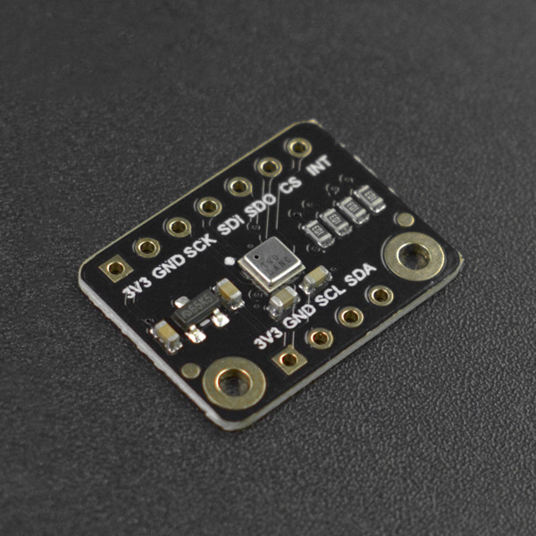

# DFRobot_ENS160
* [English Version](./README.md)

ENS160是一款数字多气体传感器解决方案, 基于金属氧化物(MOX)技术, 带有四个MOX传感器元件。
每个传感器元件都有独立的热板控制, 以检测各种气体, 如挥发性有机化合物(VOCs), 包括乙醇, 甲苯, 以及氢和二氧化氮, 具有优越的选择性和准确性。
对于室内空气质量应用, ENS160支持智能算法, 数字化处理芯片上的原始传感器测量。
这些算法计算二氧化碳当量, TVOC, 空气质量指数(AQIs), 湿度和温度补偿, 以及基线管理-全部在芯片上!
此外, 一个开发选项可用于从每个传感器元件数字输出原始传感器测量值, 以进行定制。
LGA封装设备包括一个SPI或I²C从接口与单独的VDDIO与主主机处理器通信。
ENS160是一种经过验证和免维护的技术, 专为高容量和可靠性而设计。




## 产品链接 (https://www.dfrobot.com.cn/search.php?keywords=ens160)
    SKU: SEN0514/SEN0515


## 目录

* [概述](#概述)
* [库安装](#库安装)
* [方法](#方法)
* [兼容性](#兼容性)
* [历史](#历史)
* [创作者](#创作者)


## 概述

* TrueVOC™空气质量检测, 具有行业领先的纯度和稳定性, 提供多种输出, 如eCO21, TVOC和aqis2, 符合全球iaq3信号标准
* 独立传感器加热器控制最高选择性(如乙醇, 甲苯, 丙酮, NO2)和突出的背景辨别能力
* 对硅氧烷和湿度的免疫力
* 无麻烦的片上加热器驱动器控制和数据处理-不需要外部库-没有主板cpu性能影响
* 低功耗应用程序中断阈值
* 工作范围广:温度:-40至+85°C;湿度:5 ~ 95%5;VDD: 1.71 to 1.98V;VDDIO 1.71至3.6V
* 该库支持SPI/I2C通信。


## 库安装

要使用库, 首先下载库文件, 将其粘贴到指定的目录中, 然后打开examples文件夹并在该文件夹中运行演示。


## 方法

```python

    '''!
      @brief 初始化函数
      @return  返回初始化状态
      @retval True 表示初始化成功
      @retval False 表示初始化成失败
    '''
    def begin(self):

    '''!
      @brief 配置电源模式
      @param mode 可配置的电源模式:
      @n       ENS160_SLEEP_MODE: 深度睡眠模式(低功耗待机)
      @n       ENS160_IDLE_MODE: 空闲模式(低功耗)
      @n       ENS160_STANDARD_MODE: 标准气体传感模式
    '''
    def set_PWR_mode(self, mode):

    '''!
      @brief 中断配置(INT)
      @param mode 需要设置的中断模式,下列模式经过或运算后得到mode:
      @n       在DATA_XXX寄存器中出现新数据(可获取新的测量数据)时产生中断: e_INT_mode_DIS, 禁用中断; e_INT_mode_EN, 启用中断
      @n       中断引脚输出驱动模式: e_INT_pin_OD, 开漏; e_INT_pin_PP, 推挽
      @n       中断引脚有效电平: e_INT_pin_active_low, 低电平有效; e_INT_pin_active_high, 高电平有效
    '''
    def set_INT_mode(self, mode):

    '''!
      @brief 用户将环境温度和相对湿度写入ENS160, 用于气体测量数据的校准补偿。
      @param ambient_temp 用于补偿的当前环境温度, float类型, 单位: C
      @param relative_humidity 用于补偿的当前环境温度, float类型, 单位: %rH
    '''
    def set_temp_and_hum(self, ambient_temp, relative_humidity):

    '''!
      @brief 这个API获取传感器的所有状态信息
      @return 状态结构体sensor_status, 其成员有:
      @n        status: “高”表示OPMODE正在运行;
      @n        stater: “高”表示检测到错误;
      @n        validity_flag: 0: 正常运行, 1: 预热阶段, 
      @n                      2: 初始化阶段, 3: 无效输出;
      @n        data_drdy: 测量数据准备好;
      @n        GPR_drdy: 通用寄存器数据准备好
    '''
    def get_ENS160_status(self):

    '''!
      @brief 获取根据UBA计算出的空气质量指数
      @return 返回值范围为: 1-5(对应优秀, 良好, 中等, 贫困, 不健康这五个等级)
    '''
    @property
    def get_AQI(self):

    '''!
      @brief 获取总挥发性有机化合物(TVOC)的浓度
      @return 返回值范围为: 0–65000, 单位: ppb
    '''
    @property
    def get_TVOC_ppb(self):

    '''!
      @brief 获取根据检测到的VOCs和氢报告计算出的二氧化碳当量浓度(eCO2 – Equivalent CO2)
      @return 返回值范围为: 400–65000, 单位: ppm
      @note 分为五个等级: Excellent(400 - 600), Good(600 - 800), Moderate(800 - 1000), 
      @n                  Poor(1000 - 1500), Unhealthy(> 1500)
    '''
    @property
    def get_ECO2_ppm(self):

```


## 兼容性

* RaspberryPi 版本

| Board        | Work Well | Work Wrong | Untested | Remarks |
| ------------ | :-------: | :--------: | :------: | ------- |
| RaspberryPi2 |           |            |    √     |         |
| RaspberryPi3 |           |            |    √     |         |
| RaspberryPi4 |     √     |            |          |         |

* Python 版本

| Python  | Work Well | Work Wrong | Untested | Remarks |
| ------- | :-------: | :--------: | :------: | ------- |
| Python2 |     √     |            |          |         |
| Python3 |     √     |            |          |         |


## 历史

- 2021/10/28 - 1.0.0 版本
- 2022/04/20 - 1.0.1 版本


## 创作者

Written by qsjhyy(yihuan.huang@dfrobot.com), 2021. (Welcome to our [website](https://www.dfrobot.com/))

